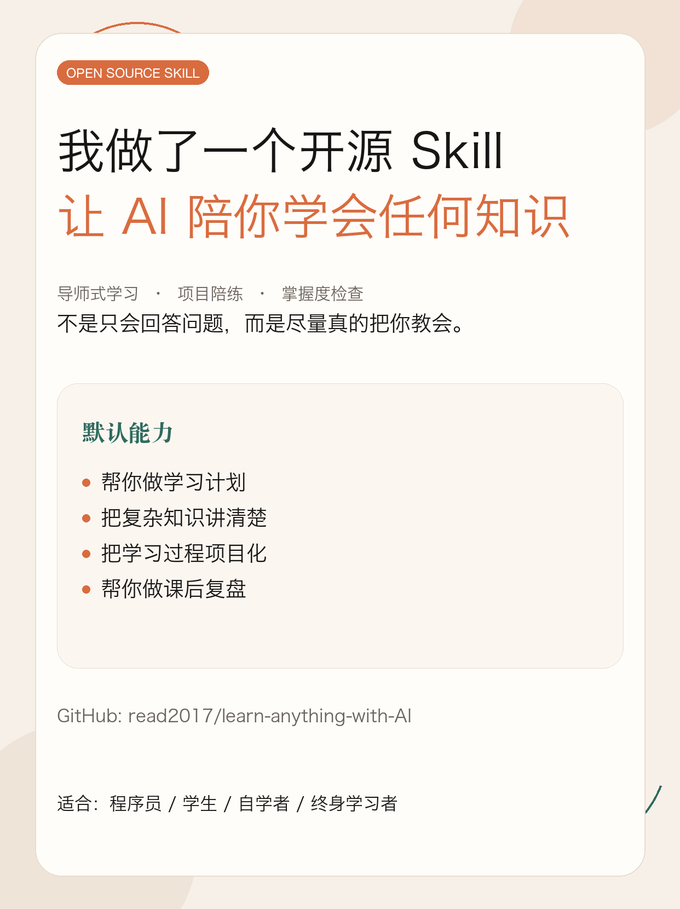
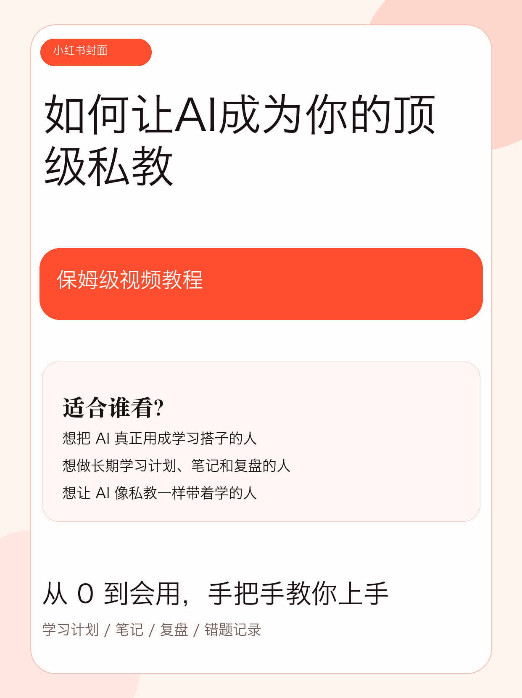

# Learn Anything Skill

    

[中文说明](./README.md)

A general-purpose AI learning skill for mastering almost any subject and turning AI into a top-tier private tutor.  
It acts as a **mentor + project coach** by default: teaching primarily in Chinese, staying warm but rigorous, and focusing on plans, structured explanations, project-style practice, mastery checks, and authoritative sources when the user does not provide materials.

> Turn AI from a question-answering tool into a study coach that actually helps you learn.

## Preview

<table>
  <tr>
    <td align="center" width="50%">
      <strong><a href="http://xhslink.com/o/4DLignz1LpA">Project intro post</a></strong><br />
      <a href="http://xhslink.com/o/4DLignz1LpA">
        
      </a>
    </td>
    <td align="center" width="50%">
      <strong><a href="http://xhslink.com/o/4DLignz1LpA">Beginner video tutorial</a></strong><br />
      <a href="http://xhslink.com/o/4DLignz1LpA">
        
      </a>
    </td>
  </tr>
</table>

## Quick Navigation

[Overview](#overview) · [Recommended Workflow](#recommended-learning-directory-workflow) · [Quick Start](#quick-start) · [Detailed Tutorial](#detailed-tutorial) · [Repository Structure](#repository-structure) · [Suitable Topics](#suitable-topics) · [Customization](#customization) · [Compatibility Notes](#compatibility-notes)

<a id="overview"></a>
## Overview

`learn-anything-skill` is a portable `SKILL.md` workflow package whose goal is not just to answer questions, but to **help users actually learn**.

- default role: `mentor + project coach`
- default method: `Project-Driven Learning + Mastery Learning`
- default outputs: study plans, study notes, session reviews, project briefs, mastery checks, and mistake logs
- default behavior: writes key learning outputs into Markdown files in the current working directory instead of leaving everything inside chat history
- default source strategy: prioritizes official docs, primary sources, canonical texts, and authoritative institutions, while separating factual basis from judgment and advice
- default projectization:
  - programming topics: demos, micro-projects, debugging tasks, and small project briefs
  - non-programming topics: short reports, presentation outlines, case analyses, knowledge maps, reading notes, and review documents

Good fit for:

- learners who want a structured path into a new topic
- people who want to move from "I know it" to "I can apply and transfer it"
- builders who prefer project-driven learning over passive explanation
- toolmakers who want a reusable open-source skill for Codex, Claude Code, and OpenCode users

<a id="recommended-learning-directory-workflow"></a>
## Recommended Learning Directory Workflow

Do not study inside a cluttered general workspace if you can avoid it.  
Create a dedicated learning directory first, then invoke the skill from inside that directory.

For example:

```bash
mkdir -p learn-ai
cd learn-ai
```

Then use `learn-anything-skill` inside that directory.

Why this is recommended:

- study plans can be saved automatically as Markdown files
- study notes can accumulate over time instead of disappearing into chat history
- session reviews, mastery checks, and mistake logs stay in one place
- materials, exercises, notes, and project briefs for one topic do not get mixed into unrelated projects

By default, the skill prefers writing learning outputs into a `study/` subdirectory under the current working directory, for example:

```text
learn-ai/
└── study/
    ├── ai-learning-plan.md
    ├── ai-notes.md
    ├── ai-session-review.md
    ├── ai-mastery-check.md
    └── ai-mistakes-log.md
```

<a id="quick-start"></a>
## Quick Start

### 1. Install the skill

Recommended via Agent Skills CLI:

```bash
npx skills add read2017/learn-anything-with-AI --skill learn-anything-skill
```

Global install:

```bash
npx skills add -g read2017/learn-anything-with-AI --skill learn-anything-skill
```

### 2. Create a learning directory

```bash
mkdir -p learn-ai
cd learn-ai
```

### 3. Start learning

```text
Use $learn-anything-skill to help me learn SQL.
I know some Python but have never studied databases systematically.
Please create a 4-week study plan and design a small project brief.
```

<a id="detailed-tutorial"></a>
## Detailed Tutorial

The homepage keeps only the shortest path. For full installation guidance, platform-specific setup, usage patterns, examples, and prompt recipes, see:

- Chinese tutorial: [docs/tutorial.md](./docs/tutorial.md)
- English tutorial: [docs/tutorial.en.md](./docs/tutorial.en.md)

Recommended order for new users:

1. watch the intro post or beginner video
2. follow the quick start steps above
3. use the detailed tutorial for your long-term study workflow

<a id="repository-structure"></a>
## Repository Structure

```text
skills/
└── learn-anything-skill/
    ├── SKILL.md
    ├── agents/
    │   └── openai.yaml
    ├── references/
    │   ├── mastery-rubric.md
    │   ├── project-patterns.md
    │   ├── source-strategy.md
    │   └── teaching-playbook.md
    └── assets/
        ├── learning-plan-template.md
        ├── mistakes-log-template.md
        ├── mastery-check-template.md
        ├── project-brief-template.md
        ├── session-review-template.md
        └── study-notes-template.md
```

<a id="suitable-topics"></a>
## Suitable Topics

This skill is not only for programmers. It works well for:

- programming and software engineering
- mathematics and statistics
- economics and finance fundamentals
- English and other language learning
- history, social science, and humanities reading
- writing, speaking, and communication training
- AI, LLM, and data-related topics

<a id="customization"></a>
## Customization

Common changes include:

- changing the tone or default language
- shifting the project style toward exams, papers, real-world work, or portfolio building
- changing the source strategy to emphasize official docs or textbook reading
- changing mastery checks to focus on problem solving, oral explanation, code implementation, or paper interpretation

Best files to edit first:

- `skills/learn-anything-skill/SKILL.md`
- `skills/learn-anything-skill/references/source-strategy.md`
- `skills/learn-anything-skill/references/project-patterns.md`
- `skills/learn-anything-skill/references/mastery-rubric.md`

<a id="compatibility-notes"></a>
## Compatibility Notes

- **OpenAI / Codex / ChatGPT Skills**: this is the most native target format
- **Claude Code**: usable directly as a skill; for broader distribution, a plugin wrapper is recommended
- **OpenCode**: better treated as a command adaptation than as a fully identical skill system
- **Other Agent Skills-compatible tools**: prefer `npx skills add`

In short: the core asset in this repository is the portable `SKILL.md + references + assets` workflow. Installation entry points differ across agents, but the teaching logic is reusable.

<details>
<summary><strong>Expand references</strong></summary>

These resources helped shape the installation and compatibility guidance:

- OpenAI Skills: <https://openai.com/academy/skills/>
- ChatGPT Skills help: <https://help.openai.com/en/articles/20001066>
- Codex app introduction: <https://openai.com/index/introducing-the-codex-app/>
- Claude Code cheatsheet: <https://support.claude.com/en/articles/14553413-claude-code-cheatsheet>
- Claude Code plugins: <https://code.claude.com/docs/en/plugins>
- OpenCode commands: <https://opencode.ai/docs/commands>

</details>

## License

This repository is released under the [MIT License](./LICENSE).
