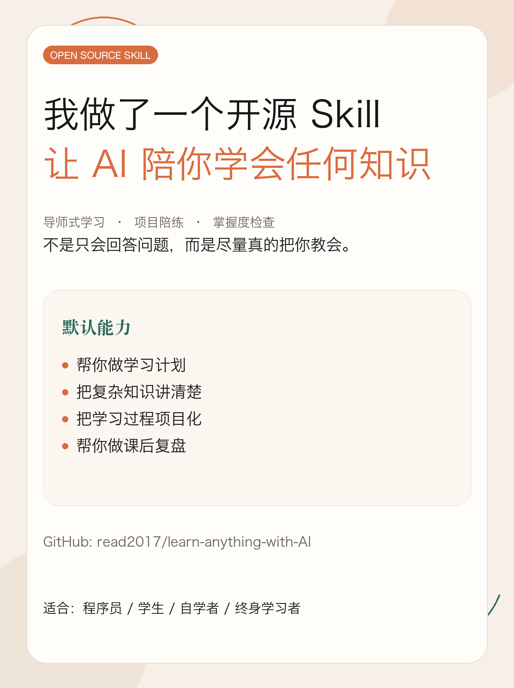
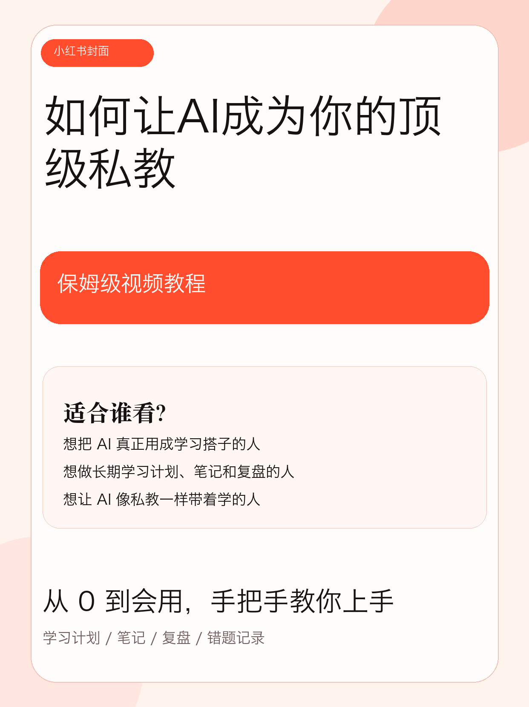

<div align="center">

# Learn Anything Skill

<p align="center">
  
</p>

> *让 AI 从「会回答问题」，变成「能带你真的学会」*

[](LICENSE)
[](https://agentskills.io)
[](#兼容性说明)
[](#简介)
[](https://github.com/read2017/learn-anything-with-AI/stargazers)

<br>

**一个可移植的 `SKILL.md` 工作流包。默认扮演「导师 + 项目教练」：先诊断起点，再给学习路线、组织项目化练习、检查掌握度，并把学习产出落盘成 Markdown 文件。**

<sub>中文主讲 · 温柔鼓励 · 优先官方文档与权威材料 · 一个 SKILL.md 走遍 Codex / Claude Code / OpenCode</sub>

<sub>⭐ Star 收藏 · 👀 Watch 订阅更新（会持续迭代）</sub>

<br>

[图文 / 视频介绍](#图文和视频介绍) · [它会什么](#简介) · [快速开始](#快速开始) · [详细教程](#详细教程) · [适用主题](#适用主题) · [**能帮你做什么**](#我能帮你做什么) · [支持这个项目](#支持这个项目) · [English README](./README.en.md)

<br>

</div>

---

## 图文和视频介绍

<table>
  <tr>
    <td align="center" width="50%">
      <strong><a href="https://xhslink.cn/o/5pRBmwGVkJe">项目图文介绍</a></strong><br />
      <a href="https://xhslink.cn/o/5pRBmwGVkJe">
        
      </a>
    </td>
    <td align="center" width="50%">
      <strong><a href="https://xhslink.cn/o/4DLignz1LpA">小白保姆级视频教程</a></strong><br />
      <a href="https://xhslink.cn/o/4DLignz1LpA">
        
      </a>
    </td>
  </tr>
</table>

## 简介

`learn-anything-skill` 是一个可移植的 `SKILL.md` 工作流包，核心目标不是“回答问题”，而是 **帮助用户真的学会**。

- 默认角色：`导师 + 项目教练`
- 默认方法：`项目驱动学习 + Mastery Learning`
- 默认产出：学习计划、学习笔记、课后复盘、项目任务书、掌握度检查、错题/卡点记录
- 默认行为：把关键学习产出写入当前工作目录下的 Markdown 文件，而不只停留在聊天记录里
- 默认来源策略：优先官方文档、原始资料、经典教材、权威机构材料，并区分事实依据与建议判断
- 默认项目化方式：
  - 编程主题：最小 demo、微项目、调试任务、小型任务书
  - 非编程主题：研究短报告、演讲提纲、案例分析、知识地图、读书笔记、复盘文档

适合：

- 想系统学习一个新主题的人
- 想把“知道”推进到“会用、会改、会迁移”的人
- 想把学习过程产品化、项目化、可复盘的人
- 想把 Skill 开源给 Codex / Claude Code / OpenCode 用户复用的人

## 推荐学习目录工作流

推荐不要直接在杂乱的工作目录里学习，而是先单独新建一个学习目录，再在这个目录里调用 Skill。

例如你想系统学习 AI，可以先创建：

```bash
mkdir -p learn-ai
cd learn-ai
```

然后在这个目录里使用 `learn-anything-skill`。

这样做的好处是：

- 学习计划会自动保存为 Markdown 文件
- 学习笔记会持续追加和沉淀
- 课后复盘、掌握度检查、错题/卡点记录会留在同一个目录
- 一个主题的资料、练习、笔记和项目任务书不会和其他项目混在一起

默认情况下，Skill 会优先把学习产出写到当前工作目录下的 `study/` 子目录，例如：

```text
learn-ai/
└── study/
    ├── ai-learning-plan.md
    ├── ai-notes.md
    ├── ai-session-review.md
    ├── ai-mastery-check.md
    └── ai-mistakes-log.md
```

## 快速开始

### 1. 安装 Skill

推荐用 Agent Skills CLI：

```bash
npx skills add read2017/learn-anything-with-AI --skill learn-anything-skill
```

如果想全局安装：

```bash
npx skills add -g read2017/learn-anything-with-AI --skill learn-anything-skill
```

### 2. 创建学习目录

```bash
mkdir -p learn-ai
cd learn-ai
```

### 3. 开始学习

```text
用 $learn-anything-skill 帮我学习 SQL。
我会一点 Python，但没系统学过数据库。
请给我一个 4 周学习计划，并设计一个小项目任务书。
```

## 详细教程

首页只保留最短路径。更完整的安装、平台适配、调用方式、案例和提示词请看独立文档：

- 中文详细教程：[docs/tutorial.md](./docs/tutorial.md)
- English tutorial: [docs/tutorial.en.md](./docs/tutorial.en.md)

如果你是第一次用，建议顺序是：

1. 先看上面的图文介绍或视频教程
2. 按“快速开始”完成安装与目录准备
3. 再看详细教程，按自己的主题开始长期学习

## 目录结构

```text
skills/
└── learn-anything-skill/
    ├── SKILL.md
    ├── agents/
    │   └── openai.yaml
    ├── references/
    │   ├── mastery-rubric.md
    │   ├── project-patterns.md
    │   ├── source-strategy.md
    │   └── teaching-playbook.md
    └── assets/
        ├── learning-plan-template.md
        ├── mistakes-log-template.md
        ├── mastery-check-template.md
        ├── project-brief-template.md
        ├── session-review-template.md
        └── study-notes-template.md
```

## 适用主题

这个 Skill 不是只给程序员用的。它适用于：

- 编程与软件工程
- 数学与统计
- 经济学与金融基础
- 英语和其他语言学习
- 历史、社会科学、人文阅读
- 写作、演讲、表达训练
- AI / LLM / 数据相关主题

## 开发与定制

如果你想改成自己的版本，最常见的修改点有：

- 改默认语气与输出语言
- 改项目风格：更偏考试、论文、实战或作品集
- 改资料策略：更强调官方文档或教材精读
- 改掌握度检查方式：更偏题目、口头复述、代码实现或论文解读

建议优先修改这些文件：

- `skills/learn-anything-skill/SKILL.md`
- `skills/learn-anything-skill/references/source-strategy.md`
- `skills/learn-anything-skill/references/project-patterns.md`
- `skills/learn-anything-skill/references/mastery-rubric.md`

## 兼容性说明

- **OpenAI / Codex / ChatGPT Skills**：这是最原生的目标形态
- **Claude Code**：可直接作为 Skill 使用；如果要发布给更多人，建议再包装成 plugin
- **OpenCode**：建议作为 command 适配，而不是假设它与本仓库的 Skill 目录完全同构
- **其他兼容 Agent Skills 的工具**：推荐优先使用 `npx skills add`

换句话说：这个仓库的核心资产是通用的 `SKILL.md + references + assets` 工作流；不同代理工具的安装入口不完全一样，但内容本身是可迁移的。

<details>
<summary><strong>展开查看参考资料</strong></summary>

以下官方资料对本仓库的安装说明和兼容性表述有帮助：

- OpenAI Skills 说明：<https://openai.com/academy/skills/>
- ChatGPT Skills 帮助中心：<https://help.openai.com/en/articles/20001066>
- Codex 与 Skills 介绍：<https://openai.com/index/introducing-the-codex-app/>
- Claude Code Commands / Skills：<https://support.claude.com/en/articles/14553413-claude-code-cheatsheet>
- Claude Code Plugins：<https://code.claude.com/docs/en/plugins>
- OpenCode Commands：<https://opencode.ai/docs/commands>

</details>

## 支持这个项目

如果这个 skill 帮你把一件事真的学会了：

- **⭐ Star** —— 让更多人看到它
- **👀 Watch** —— 订阅更新，我发新版本时你会收到通知
- **Fork** —— 改成你自己的版本（换语气、换项目风格、换资料策略都行，见[开发与定制](#开发与定制)）

有问题、想要新功能，或者想提名一个新的项目范式，欢迎开 [Issue](https://github.com/read2017/learn-anything-with-AI/issues)。

### 请我喝杯咖啡

这个项目占用了我不少下班后的时间。如果你用着顺手，可以请我喝杯咖啡：

<p align="center">
  
  <br/>
  <sub>微信赞赏码 · 纯打赏，<b>不用于购买服务</b></sub>
</p>

*海外的朋友可以用 [Ko-fi](https://ko-fi.com/)（链接待补）。*

---

## 我能帮你做什么

这个仓库来自我自己的真实需求。如果你也有类似场景，我提供一对一的服务：

| 服务 | 适合谁 | 交付什么 |
|---|---|---|
| **定制 skill** | 你有一套自己的工作流、知识或内容，想把它变成 AI 能直接用的 skill | 沟通确认场景 → 交付可用的 `SKILL.md` 包 |
| **人物蒸馏** | 你想把某位博主 / 领域专家的公开内容，提炼成「能按他的方式回答」的 AI 助手 | 从语料采集、统计分析到 skill 交付的完整流程 |
| **AI 工作流咨询** | 想让 AI 真正嵌进业务流程，而不是停在聊天框里 | 按你的具体场景评估可行性 |

**实物案例**：[jianghushuo-oral-skill](https://github.com/read2017/jianghushuo-oral-skill) —— 把一位 489 万粉博主的 433 条视频（94.7 万字）蒸馏成一个 skill：提炼出 6 个心智模型、15 组内在矛盾，独立盲测评分 **90/100**，每一条引用都能回溯到原片秒数。

📮 **read2016@qq.com** —— 邮件说明你的场景，我一般当天回。

> **边界说明**：人物蒸馏类服务只处理**你有权使用的内容**——你自己的账号、你已获授权的素材，或公开内容用于个人研究。我不代人处理无权分发的他人内容。

---

## 关于作者

**沉思哲**（AI 产品研发）· GitHub [@read2017](https://github.com/read2017)

我擅长把「实际做过的事」变成可复用的 AI 工具，也在小红书和抖音记录这个过程。

<table>
  <tr>
    <td align="center" width="50%"><strong>抖音</strong><br/></td>
    <td align="center" width="50%"><strong>小红书</strong><br/></td>
  </tr>
</table>

📮 read2016@qq.com

## License

本仓库使用 [MIT License](./LICENSE)。
